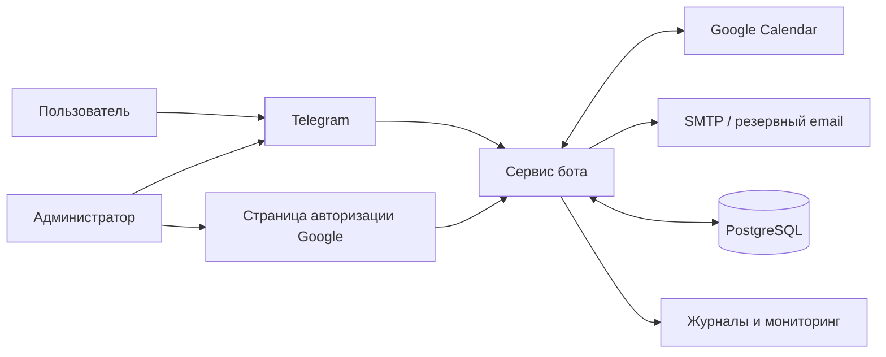
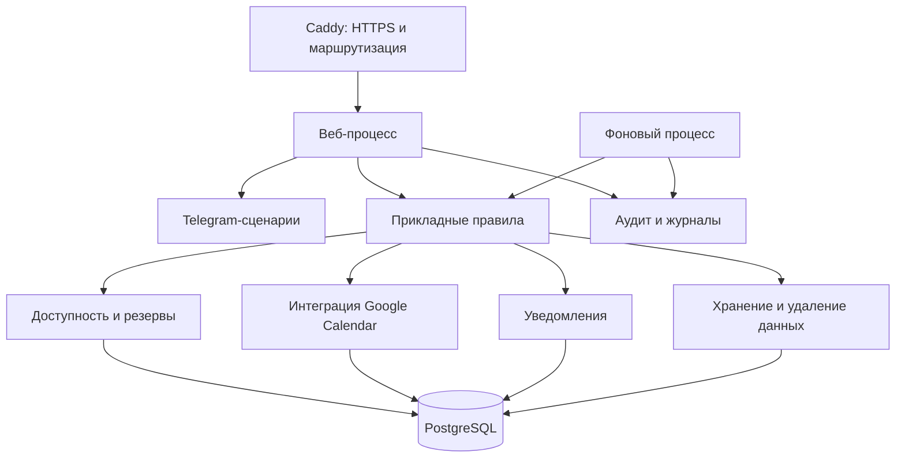
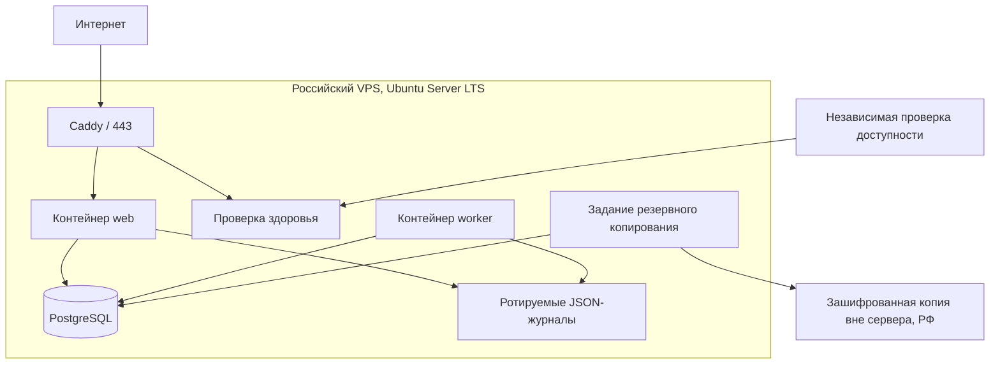
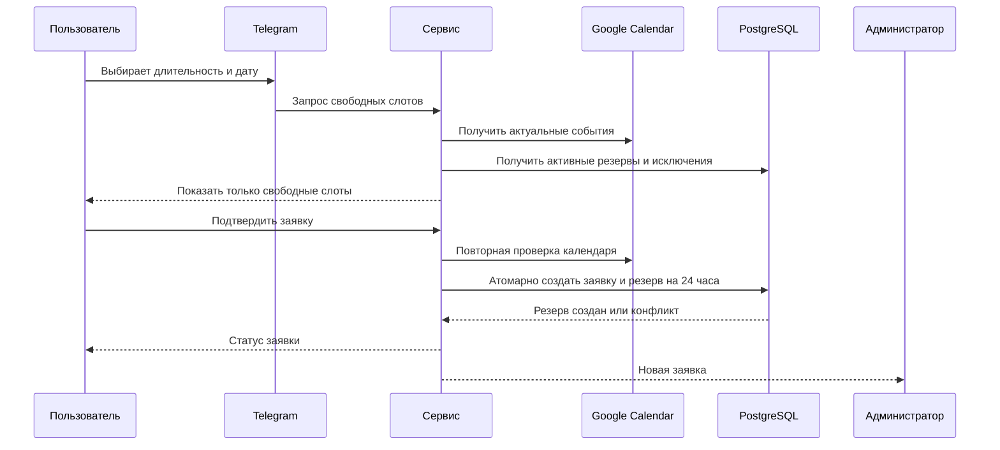
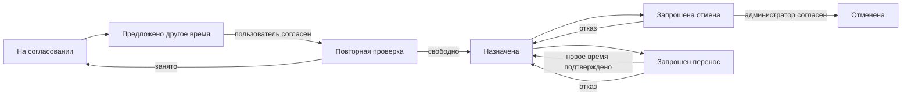
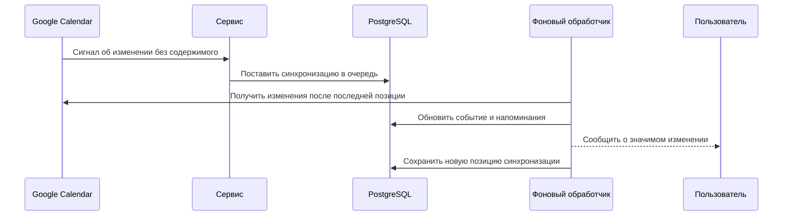
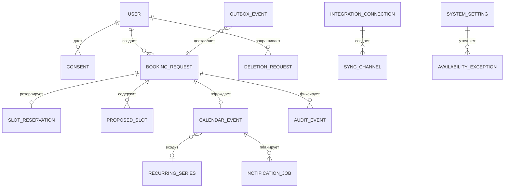
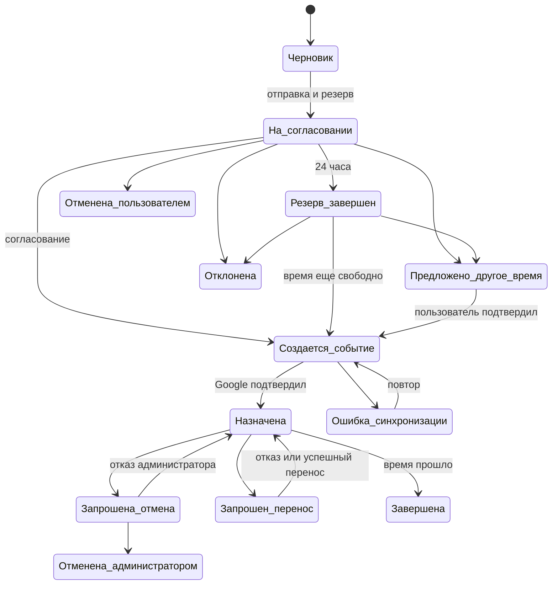
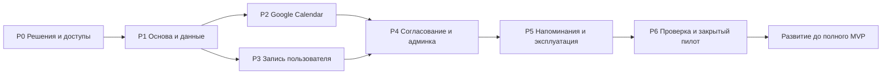
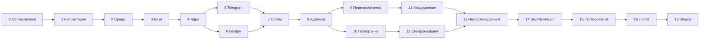

# Этапы разработки Telegram-бота календаря

Версия документа: 0.10 — план «быстрый пилот → полный MVP», проект на согласование  
Дата актуализации: 7 августа 2026 года  
Основание: `ТЗ_Telegram-бот_Google-Calendar_v1.1.md`  
Статус подготовительного этапа: ожидается согласование технологического пакета заказчиком  

> Этот документ является планом. На подготовительном этапе программный код, инфраструктура, база данных и интеграции не создаются.

## 1. Назначение документа

Документ переводит утверждённое ТЗ в последовательный план разработки. Для каждого этапа определены зависимости, результат, журналы, автоматические и ручные проверки, аварийные сценарии, критерии готовности, доказательства выполнения и участие заказчика.

Цель — сделать разработку управляемой и проверяемой: следующий этап начинается только после подтверждения Definition of Done предыдущего этапа.

## 2. Исходное состояние и допущения

### 2.1. Что проверено

- В рабочей папке находятся только ТЗ и подготовительный промпт; программной реализации пока нет.
- Нагрузка ожидается небольшой: несколько встреч в неделю, до 20 одновременных пользователей по требованиям ТЗ.
- Администратор один.
- Используется один личный Google Calendar.
- Данные и резервные копии должны размещаться на территории России; юридическая проверка политики обработки персональных данных остаётся обязанностью владельца проекта.
- Администратор работает через Telegram, без отдельного веб-кабинета в MVP.
- Технологические сведения проверены по официальной документации 7 августа 2026 года.

### 2.2. Принятые архитектурные допущения

1. Проект реализуется как модульный монолит: одно приложение, разделённое внутри на независимые продуктовые модули.
2. Приложение запускается двумя процессами из одной версии: веб-процесс принимает внешние обращения, фоновый процесс исполняет напоминания, синхронизацию и повторные попытки.
3. PostgreSQL является единственным обязательным хранилищем и используется также для надёжной очереди фоновых заданий. Redis и отдельный брокер сообщений для MVP не требуются.
4. Производственная среда размещается на одном Linux-сервере в России. Windows рассматривается только как вынужденный вариант.
5. Все даты хранятся в UTC; пользователю и администратору показывается Europe/Moscow.
6. Пользовательская заявка и резерв слота — разные сущности: заявка сохраняется, резерв автоматически завершается через 24 часа.
7. Google-уведомления не считаются гарантированной доставкой; кроме них выполняется периодическая сверка календаря.
8. Telegram и Google могут повторно доставить одно обращение, поэтому все внешние операции проектируются идемпотентными — повтор не меняет результат и не создаёт дубликат.
9. Future scope подключается через внутренний прикладной слой: будущий Mini App будет использовать те же правила и данные, что и Telegram-бот.

## 2.3. Стратегия «быстрый пилот → полный MVP»

Чтобы получить работающую версию раньше, реализация делится на два самостоятельных релизных контура:

1. **Быстрый закрытый пилот** — минимальный безопасный продукт для администратора и 2–5 доверенных пользователей. Он проверяет главный бизнес-цикл: найти свободное время, отправить заявку, согласовать её и создать встречу в Google Calendar.
2. **Полный MVP** — развитие пилота до полного объёма ТЗ v1.1, включая повторяющиеся встречи, изменение отдельных повторений, полноценную синхронизацию, полную админку, автоматическое удаление данных, расширенную статистику и все эксплуатационные проверки.

Пилот не является публичным запуском и не заменяет критерии приёмки полного MVP. Его ссылка не распространяется неограниченному кругу пользователей. При обнаружении критической ошибки новые заявки можно временно отключить без удаления уже созданных встреч.

### 2.3.1. Обязательный scope быстрого пилота

В пилот включаются:

- русский Telegram-бот и постоянная ссылка;
- единственный администратор по Telegram ID;
- политика конфиденциальности и согласие пользователя;
- имя из Telegram, email, тема, необязательные описание и место/ссылка;
- длительности 15, 30, 45, 60 и 90 минут;
- шаг начала 15 минут, горизонт 30 дней и минимальный срок 2 часа;
- чтение одного личного Google Calendar;
- различение блокирующих и неблокирующих событий;
- отображение только свободных слотов без содержания календаря;
- заявка и резерв слота на 24 часа;
- защита от одновременного бронирования одного времени;
- редактирование и отмена несогласованной заявки;
- уведомление администратора;
- согласование и отклонение заявки;
- предложение одного альтернативного слота с подтверждением пользователя;
- создание одного события Google Calendar и добавление email гостя;
- ручное создание администратором разовой встречи с гостем или без гостя;
- разрешённое администратору пересечение после отдельного предупреждения;
- запрос пользователем отмены назначенной встречи;
- перенос в упрощённом виде: администратор отменяет/изменяет исходное событие после подтверждения нового свободного времени;
- Telegram-напоминания за 24 часа, 1 час и 5 минут;
- ограниченные настройки в Telegram: включить/выключить запись, минимальный срок, горизонт, срок резерва и интервалы напоминаний;
- базовые структурированные журналы и административный аудит;
- безопасное хранение токена Google;
- ежедневная резервная копия и одна проверка восстановления до пилота;
- health-check и критические уведомления администратору;
- закрытый тест на 2–5 доверенных пользователях.

### 2.3.2. Осознанно отложено из пилота в полный MVP

- несколько альтернативных слотов в одной заявке;
- повторяющиеся встречи и управление отдельными повторениями;
- push-уведомления Google Calendar и автоматическое продление каналов;
- мгновенная двусторонняя синхронизация ручных изменений Google;
- сложные правила доступных дней/часов и календарь исключений в админке;
- полный набор редактирования уже назначенной встречи через Telegram;
- автоматизированные два сценария удаления данных; в пилоте запрос обрабатывается администратором по регламенту;
- полная статистика по произвольным периодам; в пилоте достаточно контрольных счётчиков;
- независимый полнофункциональный дашборд мониторинга;
- ежемесячная автоматическая проверка восстановления;
- расширенные нагрузочные, хаос- и длительные тесты сверх минимального release gate.

Эти функции не удаляются из ТЗ и не переносятся в V2. Они составляют следующий релиз **«Полный MVP»** сразу после пилота.

### 2.3.3. Временные правила эксплуатации пилота

1. Пилот работает не более четырёх недель либо до завершения приёмки полного MVP — что наступит раньше.
2. Доступ предоставляется только 2–5 заранее уведомлённым пользователям.
3. Администратор не изменяет созданные ботом встречи непосредственно в Google Calendar без последующей проверки в боте. Перед каждым критическим действием бот всё равно получает актуальное состояние календаря.
4. Вместо Google push в пилоте выполняются проверки календаря при показе слотов, отправке заявки, согласовании, изменении и перед напоминанием. Допустима периодическая контрольная сверка.
5. Запрос на удаление данных принимается ботом, блокирует дальнейшее использование и направляется администратору; исполнение фиксируется в аудите по ручному регламенту.
6. При недоступности Google новые согласования приостанавливаются, но заявки не теряются.
7. При критической ошибке функция новой записи отключается до исправления; существующие календарные события не удаляются автоматически.

### 2.3.4. Этапы быстрого пилота

| Этап | Содержание | Оценка | Проверяемый результат |
|---|---|---:|---|
| P0. Решения и доступы | Утвердить стек, серверный подход, тестовый бот/календарь и владельцев доступов | 1–2 дня | Все решения зафиксированы, секреты не передавались в чат |
| P1. Основа и данные | Репозиторий, воспроизводимое окружение, PostgreSQL, основные сущности, миграции, базовые логи | 2–3 дня | Чистая среда поднимается, миграции и восстановление проходят |
| P2. Google Calendar | OAuth, безопасный токен, чтение busy/free, создание/изменение/отмена разового события | 2–4 дня | Сквозной тест с отдельным тестовым календарём проходит без дублей |
| P3. Запись пользователя | Согласие, форма, свободные слоты, 24-часовой резерв, редактирование/отмена, конкурентная защита | 3–5 дней | Два одновременных пользователя не получают один активный резерв |
| P4. Согласование и админка | Принять/отклонить, одна альтернатива, ручная встреча, пересечение, отмена/упрощённый перенос | 3–5 дней | Заявка превращается ровно в одно событие, все роли соблюдены |
| P5. Напоминания и эксплуатация | Durable reminders, аудит, health, критические оповещения, backup | 2–3 дня | Перезапуск не теряет задания; backup успешно восстановлен |
| P6. Приёмка и закрытый запуск | Автотесты, security checklist, реальные E2E, 2–5 пользователей, наблюдение | 2–3 дня + наблюдение | Три успешных цикла и 48 часов без критического дефекта |

Общая оценка быстрого пилота: **15–25 человеко-дней**.

- Один специалист полный день: ориентировочно 3–5 рабочих недель.
- Два специалиста с разделением задач: ориентировочно 2–3 недели, поскольку часть этапов последовательна.
- Срок начинается после получения необходимых доступов и не включает ожидание регистрации домена, оплаты сервера или решения вопросов Google consent screen.

### 2.3.5. Definition of Done быстрого пилота

Пилот можно открыть доверенным пользователям, только если:

- пользователь принимает политику до отправки персональных данных;
- ни в одном ответе не раскрываются данные занятых событий;
- busy/free, all-day и часовой пояс проверены на реальном тестовом календаре;
- активный резерв действует 24 часа и не допускает пересечения;
- администратор может согласовать, отклонить и предложить одно другое время;
- согласование создаёт ровно одно Google-событие с гостем;
- ручная встреча администратора работает с гостем и без него;
- пересечение требует отдельного подтверждения;
- напоминания переживают перезапуск;
- отозванный Google-доступ и недоступность внешнего сервиса дают понятную ошибку и не теряют заявку;
- токены и персональные данные отсутствуют в журналах;
- backup успешно восстановлен на отдельной тестовой базе;
- выполнены минимум три сквозных цикла разными тестовыми пользователями;
- в течение 48 часов не возникло критического дефекта;
- заказчик подтвердил удобство основного сценария.

### 2.3.6. Что считается неуспешным пилотом

Пилот останавливается и возвращается на исправление, если:

- раскрыта информация календаря;
- два пользователя получили один активный слот;
- создан дубликат события;
- заявка или напоминание потеряны после перезапуска;
- административное действие доступно неадминистратору;
- токен или персональные данные попали в журнал;
- резервная копия не восстанавливается;
- Google-событие и статус бота противоречат друг другу и система не обнаруживает это при контрольной проверке.

## 3. Резюме рекомендуемой архитектуры

Рекомендуется модульный монолит на Python с PostgreSQL. Такой вариант соответствует небольшой нагрузке, проще микросервисов в эксплуатации и позволяет обеспечить транзакционное резервирование, долговечные напоминания, аудит и восстановление после перезапуска.

Основные части:

- Telegram-интерфейс пользователя и администратора;
- HTTPS-приложение для Telegram, Google OAuth и уведомлений Google Calendar;
- прикладные модули заявок, доступности, резервов, согласования и встреч;
- интеграционный модуль Google Calendar;
- фоновый обработчик напоминаний, повторов, очистки данных и синхронизации;
- PostgreSQL;
- Caddy для HTTPS;
- структурированные журналы, аудит, метрики и резервные копии.

Микросервисы, Kubernetes, Redis и отдельная очередь на старте не рекомендуются: они увеличат стоимость поддержки без пользы при нескольких встречах в неделю.

## 4. Архитектурные схемы

### 4.1. Контекст системы



Пользователь и администратор взаимодействуют только через Telegram, кроме однократного подключения Google. Пользователь никогда не обращается к календарю администратора напрямую.

### 4.2. Компонентная архитектура



Веб-процесс быстро подтверждает получение внешнего обращения. Всё, что может занимать время или требовать повторов, фиксируется в PostgreSQL и выполняется фоновым процессом.

### 4.3. Развёртывание



Внешние порты PostgreSQL не публикуются. Публично доступны только HTTPS и служебный адрес проверки здоровья без персональных данных.

### 4.4. Создание заявки и резервирование



Защита от двойного бронирования обеспечивается не только прикладной проверкой, но и ограничением PostgreSQL, запрещающим пересечение активных пользовательских резервов.

### 4.5. Согласование и создание события

```mermaid
sequenceDiagram
    participant A as Администратор
    participant S as Сервис
    participant G as Google Calendar
    participant D as PostgreSQL
    participant U as Пользователь

    A->>S: Согласовать заявку
    S->>D: Зафиксировать начало операции
    S->>G: Финальная проверка занятости
    alt слот свободен
        S->>G: Создать событие с гостем
        G-->>S: Идентификатор события
        S->>D: Назначена; резерв преобразован
        S-->>U: Встреча согласована
    else слот занят
        S->>D: Вернуть заявку на согласование
        S-->>A: Требуется другое время
    end
```

После неопределённой сетевой ошибки система сначала ищет результат предыдущей операции и только потом повторяет создание.

### 4.6. Альтернатива, перенос и отмена



Исходное событие сохраняется до успешного переноса; это исключает потерю обеих броней при сбое.

### 4.7. Изменение в Google Calendar



Поскольку Google прямо предупреждает, что часть уведомлений может быть потеряна, дополнительно выполняется периодическая сверка. Канал уведомлений продлевается до окончания срока действия.

## 5. Модель данных



### 5.1. Ключевые сущности

| Сущность | Назначение и обязательные данные |
|---|---|
| Пользователь | Telegram ID, отображаемое имя, username, email, язык, сроки хранения |
| Согласие | Версия политики, дата, способ принятия |
| Заявка | Тема, описание, место/ссылка, начало, окончание, длительность, статус, автор |
| Резерв | Временной диапазон, начало и окончание действия, состояние |
| Альтернативный слот | Предложенное время, состояние выбора, срок актуальности |
| Календарное событие | Идентификатор Google, версия, временной диапазон, блокирующий признак, состояние синхронизации |
| Серия | Правило ежедневно/еженедельно/ежемесячно, окончание, исключения |
| Фоновое задание | Тип, срок выполнения, число попыток, блокировка исполнителя, результат |
| Исходящее событие | Надёжная доставка уведомлений после фиксации бизнес-операции |
| Обработанное обновление | Защита от повторной обработки Telegram и Google |
| Настройка | Значение, версия, автор и время изменения |
| Исключение доступности | Запрещённый или разрешённый интервал и причина для администратора |
| Подключение Google | Зашифрованное разрешение, выбранный календарь, состояние |
| Канал синхронизации | Идентификатор, проверочный токен, срок действия, позиция синхронизации |
| Удаление данных | Выбранный вариант, состояние, срок исполнения |
| Аудит | Кто, что и когда изменил; без секретов и полного содержания встречи |

### 5.2. Жизненный цикл заявки



## 6. Технологический пакет на согласование

### 6.1. Рекомендуемый комплект

- Python 3.14, актуальный исправляющий выпуск.
- aiogram 3.x для Telegram.
- FastAPI и Uvicorn для HTTPS-точек интеграций и будущего API.
- PostgreSQL 18, актуальный исправляющий выпуск.
- SQLAlchemy 2.x и Alembic.
- PostgreSQL-очередь и паттерн transactional outbox; без Redis и Celery в MVP.
- Официальные библиотеки Google для OAuth и Calendar API.
- SMTP-адаптер с возможностью смены поставщика.
- Caddy 2 для HTTPS.
- Docker Engine и Docker Compose на Ubuntu Server 26.04 LTS.
- uv с фиксируемым lock-файлом зависимостей.
- structlog/стандартный logging в JSON, аудит в PostgreSQL.
- pytest, pytest-asyncio, Testcontainers и имитаторы внешних API.
- Ruff, mypy, pip-audit и Trivy для качества и безопасности.
- Приватный Git-репозиторий и CI/CD; рекомендуемый провайдер — GitHub.
- Ежедневные зашифрованные копии PostgreSQL с копией вне основного сервера в России.

### 6.2. Сравнение решений

| Область | Варианты | Рекомендация | Обоснование, ограничения и стоимость |
|---|---|---|---|
| Язык | Python 3.14; Node.js LTS; .NET LTS | Python 3.14 | Быстрая разработка интеграций, сильные библиотеки, низкий порог поддержки. PSF License, бесплатно. Точную исправляющую версию фиксировать lock-файлом и образом |
| Telegram | aiogram 3; python-telegram-bot; прямой Bot API | aiogram 3 | Асинхронность, FSM и быстрые обновления Bot API. MIT, бесплатно. Не использовать dev-ветку в production |
| Веб-слой | FastAPI; aiohttp; Django | FastAPI | Удобны OAuth, webhooks, health и будущий Mini App API. MIT. Django избыточен, aiohttp требует больше ручной структуры |
| Архитектура | Модульный монолит; микросервисы; serverless | Модульный монолит | Меньше точек отказа и дешевле поддержка; внутренние границы сохраняют расширяемость |
| База | PostgreSQL 18; MySQL; SQLite | PostgreSQL 18 | Надёжные транзакции, диапазоны времени и запрет пересечений. PostgreSQL License. SQLite недостаточен для конкурентного бронирования |
| Доступ к данным | SQLAlchemy 2; Django ORM; прямой SQL | SQLAlchemy 2 | Асинхронный режим, независимость слоёв. MIT. Критические ограничения БД всё равно проверяются отдельными тестами |
| Миграции | Alembic; ручные сценарии; миграции Django | Alembic | Штатно работает с SQLAlchemy, имеет историю и откат. MIT, бесплатно |
| Фоновые задания | PostgreSQL worker; Celery+Redis; APScheduler | PostgreSQL worker | Задания переживают перезапуск и фиксируются в одной транзакции с заявкой. Нет отдельного Redis. Требуется аккуратная блокировка и повторные попытки |
| Очередь | PostgreSQL; Redis; RabbitMQ | PostgreSQL для MVP | Достаточно для малой нагрузки. Redis/RabbitMQ добавляются только при измеренной потребности |
| Google | OAuth web-server + официальные библиотеки; прямой REST; service account | OAuth web-server | Личный аккаунт требует пользовательского OAuth. Service account сам по себе не имеет доступа к личному календарю |
| Telegram updates | Webhook; long polling | Webhook в production | Быстрая доставка, единый HTTPS-вход. Для локальной разработки разрешён polling |
| Google changes | Push + периодическая сверка; только polling; только push | Push + сверка | Push может теряться и имеет истекающие каналы; сверка закрывает пробелы |
| Email | SMTP владельца; транзакционный SMTP; Gmail API | Сменный SMTP-адаптер | При малом объёме достаточно SMTP. Поставщик и стоимость согласуются перед запуском |
| Секреты | Защищённый файл окружения + шифрование токена; Vault; открытый файл | Защищённый файл вне репозитория | Для одного сервера Vault избыточен. Google-токен шифруется, ключ хранится отдельно. Бесплатно |
| HTTPS | Caddy; Nginx+Certbot; IIS | Caddy 2 | Автоматически получает и продлевает сертификат, проще эксплуатации. Apache 2.0, бесплатно |
| Контейнеры | Docker Compose; native services; Kubernetes | Docker Compose | Воспроизводимость и простой откат на одном сервере. Docker Engine бесплатен; Docker Desktop не нужен |
| ОС | Ubuntu 26.04 LTS; Windows Server; PaaS | Ubuntu 26.04 LTS | Дольше поддержка, проще Docker и автоматизация. Windows допустим, но сложнее и дороже сопровождать |
| Зависимости | uv; Poetry; pip-tools | uv + lock-файл | Воспроизводимые установки на Windows/Linux и единый lock-файл. Apache 2.0/MIT, бесплатно |
| Логи | JSON structlog; Loguru; текстовые файлы | JSON structlog + стандартный logging | Структурированный поиск, единый контекст, маскирование. MIT/Apache 2.0, бесплатно |
| Мониторинг | Health+метрики+внешняя проверка; Prometheus/Grafana; только логи | Health+метрики+независимая проверка | Для малой нагрузки проще. Prometheus/Grafana подключаются при необходимости. Внешний поставщик может быть платным |
| Backup | pg_dump+шифрованное off-site; pgBackRest; только локальная копия | Ежедневный dump + off-site в РФ | Достаточно для RPO 24 часа. Хранилище вне сервера обычно платное; только локальная копия недопустима |
| Тесты | pytest; unittest; ручные проверки | pytest + Testcontainers | Покрывает правила, PostgreSQL и интеграции. Бесплатно; CI требует Docker |
| Качество | Ruff+mypy; Black+Flake8; только review | Ruff+mypy | Меньше инструментов, быстрые проверки. Бесплатно. Версии фиксируются |
| Безопасность | pip-audit+Trivy; Dependabot/Renovate; вручную | pip-audit+Trivy и обновления репозитория | Проверка Python-зависимостей и контейнеров. Бесплатно; результаты требуют оценки, а не слепого обновления |
| Git/CI | GitHub+Actions; GitLab; только локальный Git | Приватный GitHub+Actions | Удобные проверки и история. Возможны лимиты/внешнее размещение; выбор требует согласия владельца |

### 6.3. Проверенные актуальные ограничения

- Python 3.14 является актуальной feature-серией; на 10 июня 2026 опубликован выпуск 3.14.6: [Python.org](https://www.python.org/downloads/release/python-3146/).
- Актуальная документация aiogram 3 требует Python 3.10+ и поддерживает современный Bot API: [aiogram](https://docs.aiogram.dev/en/dev-3.x/). В production должна использоваться последняя стабильная версия, не dev-ветка.
- PostgreSQL 18 поддерживается до ноября 2030; применяются актуальные minor-обновления: [PostgreSQL versioning](https://www.postgresql.org/support/versioning/).
- SQLAlchemy 2 поддерживает асинхронный режим, Alembic является штатным инструментом миграций: [SQLAlchemy](https://docs.sqlalchemy.org/en/20/orm/extensions/index.html), [Alembic](https://alembic.sqlalchemy.org/en/latest/).
- Docker Compose официально допускается для production на одном сервере: [Docker Docs](https://docs.docker.com/compose/how-tos/production/).
- Ubuntu 26.04 LTS имеет стандартную поддержку безопасности до мая 2031 года: [Ubuntu release cycle](https://ubuntu.com/about/release-cycle).
- Caddy автоматически получает, обновляет сертификаты и перенаправляет HTTP на HTTPS: [Caddy Automatic HTTPS](https://caddyserver.com/docs/automatic-https).
- Telegram webhook поддерживает проверочный секретный заголовок и повторяет неуспешную доставку: [Telegram Bot API](https://core.telegram.org/bots/api).
- Google push-каналы имеют срок действия, требуют замены, не содержат деталей события и могут терять небольшую долю сообщений: [Google Calendar push notifications](https://developers.google.com/workspace/calendar/api/guides/push).
- Google OAuth для автономной серверной работы требует безопасного долгосрочного хранения refresh token; тестовый статус consent screen может ограничивать срок токена: [Google OAuth](https://developers.google.com/identity/protocols/oauth2/web-server).
- uv создаёт воспроизводимый lock-файл и проверяет его актуальность: [uv](https://docs.astral.sh/uv/concepts/projects/sync/).

## 7. Матрица покрытия ТЗ

| Раздел ТЗ | Этапы реализации и проверки |
|---|---|
| 1. Цели и метрики | 0, 15, 16, 17 |
| 2. Границы | 0, 1, 17 |
| 3. Роли | 4, 5, 8, 14 |
| 4. Пользовательские сценарии | 5, 7, 9, 11, 15 |
| 5. Админ-сценарии | 6, 8, 10, 13, 15 |
| 6. Функциональные требования | 4–13, 15 |
| 7. Бизнес-правила | 4, 7, 9, 10, 11 |
| 8. Интеграции | 5, 6, 11, 12, 16 |
| 9. Данные | 3, 4, 13, 14 |
| 10. Нефункциональные требования | 1, 2, 14, 15, 16 |
| 11. Ошибки | 6–16 |
| 12. Аналитика и мониторинг | 13, 14, 17 |
| 13. Тестирование и приёмка | все этапы, сводная приёмка 15–17 |
| 14. План релизов | 16, 17 |
| 15. Риски | все этапы, реестр рисков в разделе 13 |
| 16. Открытые вопросы | 0, раздел 15 документа |

## 8. Подробные этапы реализации

### Этап 0. Согласование архитектуры и технологий

- **Цель:** зафиксировать решения до программирования.
- **ТЗ:** все разделы, особенно 2, 8, 10, 14–16.
- **Входы и зависимости:** утверждённое ТЗ; текущий документ.
- **Шаги:** проверить требования; согласовать Linux/Windows, Git-провайдера, контейнеры, технологический пакет, email и подход к мониторингу; зафиксировать ADR — журнал архитектурных решений.
- **Технологии:** только Markdown и Mermaid.
- **Артефакты:** согласованная версия этого файла, реестр решений и рисков.
- **Журналы:** журнал решений с датой, инициатором, вариантами и причиной выбора. Секреты отсутствуют.
- **Автопроверки:** проверка наличия всех обязательных разделов, ссылок ТЗ и статусов решений.
- **Ручная проверка:** заказчик подтверждает пакет одним сообщением.
- **Негативные проверки:** поиск смешения MVP/V2, противоречий и решений без владельца.
- **Definition of Done:** архитектура и стек помечены «согласовано»; открыты только эксплуатационные реквизиты.
- **Доказательства:** утверждённый файл и запись решения.
- **Риски:** поспешный выбор сервера; снижение — не покупать услуги до согласования.
- **Откат:** изменить решение в документе до начала реализации.
- **Заказчик:** одно пакетное подтверждение.
- **Оценка:** 2–3 человеко-дня.
- **Статус:** ожидает согласования.

### Этап 1. Репозиторий и стандарты разработки

- **Цель:** обеспечить воспроизводимую и проверяемую работу с версиями.
- **ТЗ:** 10, 12–15.
- **Входы/зависимости:** этап 0, выбранный Git-провайдер.
- **Шаги:** создать приватный репозиторий; правила веток и review; структуру документов и приложения; lock-файл; шаблоны задач, архитектурных решений и отчёта этапа; автоматические проверки качества.
- **Технологии:** Git, GitHub/GitLab, uv, Ruff, mypy, pytest, pip-audit.
- **Артефакты:** репозиторий, стандарты, CI без бизнес-кода.
- **Журналы:** журнал CI, зависимости и версия окружения; без секретов.
- **Автопроверки:** воспроизводимая установка, валидный lock-файл, форматирование, статический анализ, пустой тестовый прогон.
- **Ручная проверка:** открыть историю и убедиться, что изменение связано с отчётом.
- **Негативные проверки:** секрет в репозитории, изменение защищённой ветки в обход проверки.
- **DoD:** чистая установка и все проверки проходят на новой машине/агенте CI.
- **Доказательства:** зелёный CI и отчёт этапа.
- **Риски:** внешний Git недоступен; снижение — локальное зеркало и экспорт репозитория.
- **Откат:** вернуться к предыдущему тегу.
- **Заказчик:** выбрать владельца приватного репозитория, без передачи секретов.
- **Оценка:** 1–2 дня.
- **Статус:** не начат.

### Этап 2. Среды и эксплуатационный каркас

- **Цель:** одинаковые локальная, тестовая и производственная среды.
- **ТЗ:** 8, 10, 12, 14.
- **Зависимости:** 1; сервер для production пока не обязателен.
- **Шаги:** описать контейнеры web, worker, PostgreSQL и Caddy; разделить настройки сред; health/readiness; запуск после перезагрузки; правила секретов и сетей.
- **Технологии:** Docker Engine, Compose, Ubuntu LTS, Caddy.
- **Артефакты:** инфраструктурное описание, схема портов и инструкция запуска/остановки.
- **Журналы:** запуск, остановка, health, версия образа; без значений переменных среды.
- **Автопроверки:** валидация Compose, health компонентов, отсутствие публичного порта БД.
- **Ручная проверка:** перезапустить тестовую среду и увидеть восстановление состояния.
- **Негативные проверки:** недоступна БД; истёк сертификат; занят порт.
- **DoD:** тестовая среда воспроизводится одной инструкцией и переживает перезагрузку.
- **Доказательства:** отчёт запуска, схема сети, health-результаты.
- **Риски:** Windows-хост; снижение — Linux VPS либо Linux VM.
- **Откат:** предыдущие образы и конфигурация.
- **Заказчик:** не требуется до выбора production-сервера.
- **Оценка:** 2–3 дня.
- **Статус:** не начат.

### Этап 3. База данных и миграции

- **Цель:** надёжная модель данных и контролируемые изменения схемы.
- **ТЗ:** 7, 9–11.
- **Зависимости:** 1–2.
- **Шаги:** реализовать сущности раздела 5; временные диапазоны; версии записей; историю статусов; уникальность внешних обновлений; ограничения активных резервов; миграции вверх/вниз.
- **Технологии:** PostgreSQL 18, SQLAlchemy 2, Alembic.
- **Артефакты:** модель, миграции, словарь данных.
- **Журналы:** миграция, версия схемы, длительность, результат; персональные значения не пишутся.
- **Автопроверки:** создание пустой БД; все миграции; откат; повторный подъём; ограничения и целостность.
- **Ручная проверка:** отчёт показывает актуальную версию схемы.
- **Негативные проверки:** пересекающиеся активные резервы, дубли update ID, потеря связи заявки и события.
- **DoD:** схема воспроизводима с нуля и защищает ключевые инварианты.
- **Доказательства:** тест миграций и ER-схема.
- **Риски:** необратимая миграция; снижение — backup и обязательный review.
- **Откат:** обратная миграция либо восстановление копии.
- **Заказчик:** не требуется.
- **Оценка:** 3–4 дня.
- **Статус:** не начат.

### Этап 4. Прикладное ядро и статусы

- **Цель:** реализовать бизнес-правила независимо от Telegram и Google.
- **ТЗ:** 3, 6, 7, 9, 11.
- **Зависимости:** 3.
- **Шаги:** роли; статусная модель; правила 2 часа/30 дней/15 минут/24 часа; валидация полей; изменения; права; блокирующие признаки; часы UTC/Moscow.
- **Технологии:** Python, типизированные модели, PostgreSQL.
- **Артефакты:** прикладные сценарии и таблица переходов.
- **Журналы:** операция, роль, объект, переход статуса, результат; без темы и описания.
- **Автопроверки:** все допустимые и запрещённые переходы, границы времени, права пользователя и администратора.
- **Ручная проверка:** матрица примеров «можно/нельзя» простым языком.
- **Негативные проверки:** пользователь меняет чужую заявку, администраторское действие от другого ID, недопустимый статус.
- **DoD:** бизнес-правила покрыты тестами до подключения интерфейсов.
- **Доказательства:** отчёт покрытия правил и тестов.
- **Риски:** расхождение с ТЗ; снижение — трассировка каждого теста к пункту ТЗ.
- **Откат:** предыдущая версия доменных правил и миграций.
- **Заказчик:** не требуется.
- **Оценка:** 3–5 дней.
- **Статус:** не начат.

### Этап 5. Telegram-сценарии пользователя

- **Цель:** реализовать понятный пользовательский диалог.
- **ТЗ:** 3, 4, 6, 8, 11.
- **Зависимости:** 2, 4; Google временно имитируется.
- **Шаги:** старт; согласие; меню; имя/email; создание заявки; «Мои встречи»; редактирование; отмена; помощь; восстановление прерванного диалога.
- **Технологии:** aiogram 3, webhook, FSM с состоянием в БД.
- **Артефакты:** карта экранов/сообщений и сценарии.
- **Журналы:** update ID, Telegram ID в псевдонимизированном виде, шаг диалога, результат; токен и тексты заявки запрещены.
- **Автопроверки:** имитация сообщений/кнопок, повторное обновление, неверный email, выход и возврат.
- **Ручная проверка:** пройти сценарий по инструкции без календаря.
- **Негативные проверки:** длинные строки, неожиданный порядок, заблокированный бот, удалённое сообщение.
- **DoD:** все пользовательские ветки воспроизводимы и не раскрывают чужие данные.
- **Доказательства:** протокол сценариев и скриншоты тестового бота.
- **Риски:** перегруженный диалог; снижение — короткие карточки и возврат назад.
- **Откат:** предыдущая версия текстов/маршрутов.
- **Заказчик:** финальная оценка удобства, один UAT-сеанс.
- **Оценка:** 4–6 дней.
- **Статус:** не начат.

### Этап 6. Google OAuth и базовый Calendar API

- **Цель:** безопасно подключить личный календарь.
- **ТЗ:** 5.1, 6.5, 8.2, 10, 11.
- **Зависимости:** 2–4; тестовый Google-проект.
- **Шаги:** consent screen; минимальные разрешения; state-защита; получение и шифрование токена; выбор календаря; чтение событий; создание/изменение/отмена; гостевые приглашения; переподключение.
- **Технологии:** Google OAuth web-server, официальные Python-библиотеки, AES-GCM/эквивалент для токена.
- **Артефакты:** интеграционный контракт и инструкция подключения.
- **Журналы:** тип операции, календарь в хешированном виде, HTTP-категория, попытка; токены и содержимое событий запрещены.
- **Автопроверки:** имитатор Google, обновление access token, отозванный доступ, таймаут, 429/5xx, дедупликация создания.
- **Ручная проверка:** отдельный тестовый календарь; создать, изменить и отменить событие.
- **Негативные проверки:** неверный state, просроченный код, отозванный refresh token, тестовый OAuth истёк.
- **DoD:** полный интеграционный цикл проходит без хранения секретов в открытом виде.
- **Доказательства:** интеграционный отчёт и маскированные журналы.
- **Риски:** Google verification/testing; снижение — заранее перевести consent screen в подходящий статус.
- **Откат:** отозвать токен и отключить интеграцию.
- **Заказчик:** создать/подтвердить Google-проект и один раз пройти OAuth по безопасной инструкции.
- **Оценка:** 4–6 дней.
- **Статус:** не начат.

### Этап 7. Доступность и резервирование

- **Цель:** корректно показывать слоты и исключить двойное бронирование.
- **ТЗ:** 1, 4.2–4.4, 6.2, 7.2–7.3, 11.
- **Зависимости:** 3, 4, 6.
- **Шаги:** получить события на 30 дней; различить busy/free; раскрыть повторения; применить исключения; построить сетку 15 минут; ограничить 2 часами; атомарно создать резерв; завершить его через 24 часа.
- **Технологии:** PostgreSQL range/exclusion, Google Calendar, фоновые задания.
- **Артефакты:** спецификация алгоритма и набор временных примеров.
- **Журналы:** диапазон запроса, число событий/резервов/слотов, причина отказа; без названий событий.
- **Автопроверки:** all-day busy/free, служебные события, границы полуночи, повторения, два параллельных пользователя, истечение резерва.
- **Ручная проверка:** создать в тест-календаре busy/free события и сравнить слоты.
- **Негативные проверки:** Google изменился между показом и отправкой; часы сервера отличаются; резерв истёк в момент согласования.
- **DoD:** конкурентный тест не создаёт пересечений, все примеры ТЗ проходят.
- **Доказательства:** отчёт конкурентного и календарного теста.
- **Риски:** гонка с ручным Google-изменением; снижение — финальная и постпроверка.
- **Откат:** отключить запись, сохранив чтение и данные заявок.
- **Заказчик:** не требуется.
- **Оценка:** 5–7 дней.
- **Статус:** не начат.

### Этап 8. Админка и ручные встречи

- **Цель:** дать единственному администратору полный контроль в Telegram.
- **ТЗ:** 3, 5.2–5.5, 6.4, 7, 12.
- **Зависимости:** 4–7.
- **Шаги:** список/карточка заявок; принять/отклонить/изменить/удалить; ручная встреча с гостем и без; busy/free; пересечение с двойным подтверждением; фильтры и старые заявки.
- **Технологии:** aiogram, прикладной слой, Google adapter.
- **Артефакты:** административная карта действий.
- **Журналы:** admin ID, действие, объект, старый/новый статус, результат; содержание поля не логируется.
- **Автопроверки:** чужой ID, повторное нажатие, конфликт, истёкший резерв, отсутствие email гостя.
- **Ручная проверка:** администратор проходит чек-лист на тестовых данных.
- **Негативные проверки:** подтверждение пересечения потеряно; callback устарел; Google недоступен.
- **DoD:** все админ-действия работают только у заданного ID и аудируются.
- **Доказательства:** UAT админки и аудит.
- **Риски:** ошибочное удаление; снижение — подтверждение и сохранение аудита.
- **Откат:** отмена операции в Google и восстановление статуса по аудиту.
- **Заказчик:** финальная проверка удобства.
- **Оценка:** 5–7 дней.
- **Статус:** не начат.

### Этап 9. Альтернативы, перенос и отмена

- **Цель:** завершить жизненный цикл встречи.
- **ТЗ:** 4.5–4.7, 5.2, 6.4, 7.1, 11.
- **Зависимости:** 5–8.
- **Шаги:** несколько альтернатив; подтверждение пользователя; повторная проверка; запрос отмены/переноса; решение админа; безопасная замена времени; уведомления сторон.
- **Технологии:** прикладной слой, PostgreSQL, Telegram, Google.
- **Артефакты:** таблица переходов и последовательности.
- **Журналы:** тип запроса, переход, результат синхронизации; без причины/комментария в техлоге.
- **Автопроверки:** альтернатива занята; два ответа; отмена уже отменённого; сбой после изменения Google.
- **Ручная проверка:** полный перенос и отмена тестовой встречи.
- **Негативные проверки:** старое время освобождено до подтверждения нового; недоставка Telegram.
- **DoD:** ни один сбой не оставляет встречу в ложном статусе и не теряет обе брони.
- **Доказательства:** сквозной отчёт и данные календаря.
- **Риски:** рассинхронизация; снижение — промежуточное состояние и reconciliation.
- **Откат:** вернуть исходное событие по сохранённой версии.
- **Заказчик:** не требуется до UAT.
- **Оценка:** 4–6 дней.
- **Статус:** не начат.

### Этап 10. Повторяющиеся встречи

- **Цель:** ежедневные, еженедельные и ежемесячные серии администратора.
- **ТЗ:** 5.4, 6, 11.12–11.13, UAT.
- **Зависимости:** 6, 8.
- **Шаги:** правило и окончание; проверка экземпляров в горизонте; конфликты; создание серии; изменение/отмена одного экземпляра или серии; синхронизация исключений.
- **Технологии:** Google recurrence, локальная серия и исключения.
- **Артефакты:** матрица правил повторения.
- **Журналы:** series ID, тип правила, число экземпляров/конфликтов; без содержания.
- **Автопроверки:** месяц без нужного числа, граница года, изменение одного/всех, частичный конфликт.
- **Ручная проверка:** по одной серии каждого типа.
- **Негативные проверки:** Google частично обновил серию; удалено одно повторение вручную.
- **DoD:** локальная серия и Google совпадают по всем тестовым экземплярам.
- **Доказательства:** сравнительный отчёт.
- **Риски:** сложные исключения; снижение — ограничить MVP тремя утверждёнными типами.
- **Откат:** отменить созданную серию и восстановить предыдущую версию.
- **Заказчик:** не требуется.
- **Оценка:** 3–5 дней.
- **Статус:** не начат.

### Этап 11. Напоминания и email

- **Цель:** надёжно отправлять сообщения после перезапуска и временных сбоев.
- **ТЗ:** 6.6, 7.4, 8.3, 10.3, 11, 12.
- **Зависимости:** 3–5, 9; SMTP-реквизиты для реального теста.
- **Шаги:** durable jobs; 24ч/1ч/5мин; ежедневное напоминание о заявке; отмена старых заданий; повторы; dead-letter состояние; резервный email; защита от дублей.
- **Технологии:** PostgreSQL worker/outbox, Telegram, SMTP.
- **Артефакты:** матрица уведомлений и шаблоны.
- **Журналы:** job ID, канал, срок, попытка, результат; email маскируется, текст не пишется.
- **Автопроверки:** перезапуск до срока; временный Telegram/SMTP сбой; отменённая встреча; встреча создана поздно; неизвестный результат доставки.
- **Ручная проверка:** ускоренный тест с короткими интервалами в тестовой среде.
- **Негативные проверки:** встреча уже началась, пользователь заблокировал бота, SMTP неверен.
- **DoD:** задания не теряются, устаревшие не отправляются, критические ошибки видны.
- **Доказательства:** журнал worker и отчёт доставок.
- **Риски:** редкий дубль при сетевой неопределённости; снижение — idempotency и явный аудит.
- **Откат:** приостановить worker без потери очереди.
- **Заказчик:** выбрать/создать резервный email и SMTP-доступ безопасным способом.
- **Оценка:** 4–6 дней.
- **Статус:** не начат.

### Этап 12. Синхронизация изменений Google

- **Цель:** отражать ручные изменения календаря и не пропускать их.
- **ТЗ:** 6.7, 8.2, 11.11–11.13, 12.
- **Зависимости:** 6, 10–11.
- **Шаги:** HTTPS-канал; проверочный token; хранение срока; плановое продление с перекрытием; incremental sync; периодическая полная/контрольная сверка; обновление напоминаний и слотов.
- **Технологии:** Google push notifications, sync token, PostgreSQL worker.
- **Артефакты:** регламент синхронизации.
- **Журналы:** channel ID, message number, срок, sync position, число изменений; без деталей событий.
- **Автопроверки:** повторный/пропущенный сигнал, истёкший канал, недействительный sync token, изменение/удаление.
- **Ручная проверка:** изменить событие в Google и дождаться обновления бота.
- **Негативные проверки:** push не пришёл; два канала активны; уведомление поддельно.
- **DoD:** контрольная сверка исправляет пропущенные push-сигналы в установленное окно.
- **Доказательства:** отчёт push и reconciliation.
- **Риски:** push не гарантирован; снижение — гибридная синхронизация.
- **Откат:** отключить push и временно использовать периодическую сверку.
- **Заказчик:** не требуется.
- **Оценка:** 4–6 дней.
- **Статус:** не начат.

### Этап 13. Настройки, статистика и жизненный цикл данных

- **Цель:** завершить административные настройки и требования хранения.
- **ТЗ:** 5.5, 6, 9, 12.
- **Зависимости:** 3–12.
- **Шаги:** настройка длительностей, шага, 2 часов, 30 дней, 24 часов, доступности, исключений, уведомлений; агрегаты статистики; 12-месячная очистка; два сценария удаления данных.
- **Технологии:** PostgreSQL, Telegram admin UI, worker.
- **Артефакты:** каталог настроек и политика жизненного цикла.
- **Журналы:** кто изменил настройку, старая/новая версия без секретных значений; задания очистки.
- **Автопроверки:** неверные диапазоны; настройка влияет на новые слоты; удаление с/без будущей встречи; повторный запрос.
- **Ручная проверка:** изменить каждый параметр и увидеть ожидаемый результат.
- **Негативные проверки:** удалить администратора; горизонт меньше минимального срока; очистка затронула активную встречу.
- **DoD:** настройки валидируются, статистика сверяется с контрольными данными, удаление необратимо только после подтверждения.
- **Доказательства:** отчёт настроек, статистики и удаления.
- **Риски:** юридическая трактовка; снижение — утвердить политику с юристом.
- **Откат:** настройки версионируются; удаление данных не откатывается и требует backup-процедуры только для аварии.
- **Заказчик:** предоставить текст политики, контакт и юридическое подтверждение.
- **Оценка:** 4–6 дней.
- **Статус:** не начат.

### Этап 14. Безопасность, логирование, мониторинг и backup

- **Цель:** сделать систему диагностируемой и восстанавливаемой.
- **ТЗ:** 9.5, 10, 11, 12, 15.
- **Зависимости:** все функциональные этапы; базовые меры внедряются с этапа 1.
- **Шаги:** threat model; секреты; rate limit; webhook tokens; JSON-логи; аудит; ротация; health/metrics; email alerts; ежедневный backup; off-site; восстановление; runbook инцидента.
- **Технологии:** structlog, Docker log rotation, PostgreSQL audit, health/metrics, pg_dump, шифрование.
- **Артефакты:** модель угроз, logging policy, runbooks, backup policy.
- **Журналы:** категории из раздела 10; отдельный аудит; запреты PII.
- **Автопроверки:** secret scanning, dependency/container audit, redaction tests, backup integrity, alarm tests.
- **Ручная проверка:** восстановить тестовую БД на отдельном экземпляре; найти операцию по correlation ID.
- **Негативные проверки:** диск заполнен; backup повреждён; email не работает; секрет попал в сообщение ошибки.
- **DoD:** RPO/RTO подтверждены тестом, критический путь диагностируется без чтения персональных данных.
- **Доказательства:** отчёт восстановления и security checklist.
- **Риски:** мониторинг на том же сервере не видит полный outage; снижение — независимый внешний health-check.
- **Откат:** предыдущая конфигурация, восстановление из проверенной копии.
- **Заказчик:** выбрать off-site хранилище и разрешить тест аварийного уведомления.
- **Оценка:** 5–7 дней.
- **Статус:** не начат.

### Этап 15. Комплексное тестирование и UAT

- **Цель:** доказать соответствие ТЗ до production.
- **ТЗ:** 1.3, 10–13.
- **Зависимости:** 3–14.
- **Шаги:** unit, DB, integration, contract, end-to-end, concurrency, security, retention, performance, failure injection; полный UAT checklist ТЗ.
- **Технологии:** pytest, pytest-asyncio, Testcontainers, HTTP mocks, тестовые Telegram/Google.
- **Артефакты:** тест-план, результаты, реестр дефектов, traceability matrix.
- **Журналы:** отдельный test run ID, версия, среда, результаты; тестовые персональные данные.
- **Автопроверки:** все перечисленные наборы; 20 параллельных пользователей; повторные webhooks; recovery.
- **Ручная проверка:** заказчику только финальный пользовательский и административный UAT по короткой инструкции.
- **Негативные проверки:** каждый сценарий раздела 11 ТЗ и отказ компонентов.
- **DoD:** 100% обязательного UAT; нет критических/высоких дефектов; показатели производительности достигнуты.
- **Доказательства:** подписанный тест-отчёт и версия release candidate.
- **Риски:** внешние API нестабильны; снижение — разделить mock и real tests.
- **Откат:** release candidate не допускается к production.
- **Заказчик:** оценить удобство и подтвердить соответствие ожиданиям.
- **Оценка:** 6–9 дней.
- **Статус:** не начат.

### Этап 16. Production-сервер и закрытый пилот

- **Цель:** безопасно развернуть проверенную версию для ограниченной группы.
- **ТЗ:** 8, 10, 12–15.
- **Зависимости:** 0–15; сервер, домен, аккаунты.
- **Шаги:** hardening Ubuntu; firewall; Docker; DNS/HTTPS; секреты; БД; backup; OAuth production status; Telegram webhook; smoke test; 2–3 пилотных пользователя; ежедневный анализ ошибок.
- **Технологии:** Ubuntu, Docker Compose, Caddy, PostgreSQL, monitoring.
- **Артефакты:** production runbook, inventory, deployment report.
- **Журналы:** версия, миграции, health, deployment ID; секреты не выводятся.
- **Автопроверки:** HTTPS, webhook secrets, DB private, backup, health, smoke, rollback readiness.
- **Ручная проверка:** пилотный полный цикл и приглашение в реальный календарь.
- **Негативные проверки:** перезапуск сервера, временное отключение Google, восстановление backup.
- **DoD:** минимум 3 успешных сквозных цикла, 48 часов без критического дефекта, аварийные оповещения работают.
- **Доказательства:** пилотный отчёт и Go/No-Go checklist.
- **Риски:** доступность Google/Telegram из выбранного ЦОД; снижение — проверить до покупки долгого тарифа.
- **Откат:** предыдущий образ и восстановление БД; webhook переводится в режим обслуживания.
- **Заказчик:** приобрести/предоставить сервер, домен, аккаунты и участвовать в одном реальном тесте.
- **Оценка:** 3–5 дней без периода наблюдения.
- **Статус:** не начат.

### Этап 17. Приёмка, публичный запуск и стабилизация

- **Цель:** открыть ссылку пользователям и контролировать первые недели.
- **ТЗ:** 1, 13–15.
- **Зависимости:** успешный пилот 16.
- **Шаги:** финальный Go/No-Go; backup; release tag; публикация ссылки; усиленный мониторинг; ежедневный обзор первую неделю; исправления только через проверяемый release; ретроспектива и V2 backlog.
- **Технологии:** утверждённый production stack.
- **Артефакты:** акт приёмки, release notes, инструкции, backlog V2.
- **Журналы:** версия, deployment ID, ключевые метрики, инциденты.
- **Автопроверки:** post-deploy smoke, health, synthetic booking без создания реального события либо на тестовом календаре.
- **Ручная проверка:** заказчик разрешает публикацию и подтверждает основной сценарий.
- **Негативные проверки:** rollback drill до открытия ссылки; отключение новых заявок без остановки админки.
- **DoD:** UAT принят, мониторинг и backup зелёные, инструкции переданы, заказчик дал разрешение.
- **Доказательства:** акт, тег версии, отчёт запуска.
- **Риски:** ранний публичный дефект; снижение — feature flags и быстрый rollback.
- **Откат:** закрыть новую запись, вернуть предыдущую версию, восстановить данные при необходимости.
- **Заказчик:** только разрешение на публичный запуск.
- **Оценка:** 2–4 дня плюс 1–2 недели наблюдения.
- **Статус:** не начат.

## 9. Общая стратегия тестирования

| Уровень | Что проверяется | Когда | Доказательство |
|---|---|---|---|
| Unit | Правила, статусы, время, валидация | каждый commit | CI report |
| Database | Миграции, ограничения, конкурентность | каждый merge | PostgreSQL integration report |
| Contract | Форматы Telegram/Google/SMTP | каждый merge | mock contract tests |
| Integration | Реальная БД и тестовые внешние аккаунты | перед release candidate | integration report |
| End-to-end | Полный пользовательский и админский путь | перед пилотом | E2E report |
| Failure/recovery | 429/5xx, таймаут, повтор, restart, backup | перед пилотом и релизом | resilience report |
| Security | Роли, секреты, зависимости, контейнеры, rate limit | CI и release gate | security report |
| Performance | 20 одновременных пользователей и SLA | release candidate | load report |
| UAT | Чек-лист раздела 13 ТЗ | перед публичным запуском | подписанный UAT |

Внешние сервисы проверяются на трёх уровнях: имитация для каждой ветки, тестовая интеграция, затем ограниченный реальный сквозной тест.

## 10. Стандарт журналов и диагностических отчётов

### 10.1. Формат

Производственные журналы — JSON, одна запись на событие. Обязательные поля:

- timestamp UTC;
- level;
- service и component;
- environment;
- application_version и deployment_id;
- correlation_id;
- operation;
- booking_id/series_id/job_id при наличии;
- actor_type и псевдонимизированный actor_id;
- result;
- duration_ms;
- error_category и retry_number;
- external_status без тела ответа.

### 10.2. Категории

- application;
- admin_audit;
- telegram;
- google_calendar;
- oauth;
- worker;
- notification;
- email;
- database;
- security;
- backup_restore;
- deployment.

### 10.3. Что запрещено логировать

- токены Telegram и Google;
- OAuth-коды, пароли и ключи шифрования;
- полный email без необходимости;
- тему и описание встречи;
- адрес/ссылку встречи;
- содержимое календарных событий;
- текст политики и персональные данные сверх минимума;
- полные входящие/исходящие payload внешних сервисов.

### 10.4. Хранение и поиск

- Горячие журналы: 30 дней.
- Архив технических журналов: до 90 дней.
- Административный аудит: 12 месяцев вместе с жизненным циклом заявки.
- Ротация по размеру и дате; контейнер не может заполнить весь диск.
- Поиск выполняется по correlation ID, booking ID, job ID, deployment ID и категории ошибки.
- Диагностический пакет содержит только маскированные записи заданного временного интервала.

### 10.5. Отчёт после этапа

После каждого этапа создаётся Markdown-отчёт:

- этап, дата, версия;
- выполненные проверки;
- результат каждой проверки;
- ссылки на логи и артефакты;
- найденные дефекты и исправления;
- остаточные риски;
- решение: готов / не готов к следующему этапу.

## 11. Развёртывание, откат и восстановление

1. Каждая поставка имеет неизменяемый номер версии и образ.
2. До поставки создаётся backup и проверяется совместимость миграций.
3. Миграции сначала проходят на копии production-схемы без персональных данных.
4. После развёртывания запускаются smoke-тесты.
5. При ошибке новая запись отключается, версия возвращается, затем при необходимости восстанавливается БД.
6. Ежедневная копия шифруется и выгружается вне основного сервера в России.
7. Копии хранятся 30 дней.
8. Полное тестовое восстановление обязательно перед пилотом и далее не реже раза в месяц.
9. Цели: RPO 24 часа, RTO 4 часа.

## 12. Критерии готовности к пилоту и публичному запуску

### Пилот

- согласованы архитектура и стек;
- все автоматические проверки зелёные;
- нет критических/высоких дефектов;
- Google OAuth работает автономно;
- HTTPS и webhook защищены;
- backup восстановлен на тестовом экземпляре;
- мониторинг и резервный email проверены;
- политика конфиденциальности опубликована;
- выполнен один реальный цикл администратором.

### Публичный запуск

- полный UAT ТЗ пройден;
- пилот не менее 48 часов без критического сбоя;
- минимум три разных сквозных встречи успешно обработаны;
- готов и проверен rollback;
- подтверждены сроки хранения и удаление данных;
- инструкции администратора переданы;
- заказчик дал явное разрешение.

## 13. Риски и зависимости

| Риск/зависимость | Влияние | Снижение |
|---|---|---|
| Нет программной реализации | Нельзя запустить MVP 7 августа | Сначала пройти этапы 0–16; не называть документ/макет работающим MVP |
| Не выбран сервер | Нельзя настроить HTTPS и OAuth callbacks | Согласовать Linux VPS в РФ после технологического решения |
| Windows как production | Сложнее Docker, backup и автоматизация | Рекомендовать Ubuntu; при Windows использовать отдельную Linux VM |
| Google OAuth Testing | Refresh token может иметь короткий срок | Настроить consent screen и проверить автономность до пилота |
| Push Google теряется/истекает | Рассинхронизация | Продление каналов + периодическая сверка |
| Внешняя ручная правка во время брони | Возможное краткое пересечение | Финальная проверка, постпроверка и компенсационная отмена |
| Пользователь не получает приглашение | Встреча не появится автоматически | Telegram сообщает о приглашении; ручное добавление в V2 |
| Сервер в РФ не соединяется с API | Полная остановка интеграции | Тест связности до долгого тарифа, мониторинг, возможность смены ЦОД |
| Только локальный backup | Потеря вместе с сервером | Обязательная off-site копия в РФ |
| Секрет в Git/логах | Компрометация | secret scanning, redaction tests, отзыв и ротация |
| Неспециалист поддерживает систему | Долгий простой | автоматический restart, понятные alerts и runbooks |
| Scope MVP велик | Срок 68–100 человеко-дней | Критический путь, не добавлять V2, пилот только после gates |

## 14. Дорожная карта и оценки

### 14.1. Критический путь быстрого пилота



Оценка пилота: **15–25 человеко-дней**. Главный результат — рабочий основной цикл для 2–5 доверенных пользователей, а не публичный релиз полного ТЗ.

### 14.2. Развитие пилота до полного MVP



Суммарная оценка полного MVP остаётся **68–100 человеко-дней**, включая 15–25 дней пилота. После успешного пилота на оставшиеся функции и полную приёмку потребуется ориентировочно ещё **53–75 человеко-дней**.

- Один разработчик: пилот ориентировочно 3–5 рабочих недель; полный MVP — суммарно 14–20 недель.
- Два разработчика с помощью QA/DevOps: пилот ориентировочно 2–3 недели; полный MVP — суммарно 8–12 недель.
- Ускорение не должно исключать безопасность, backup, конкурентные тесты и пилот.

Оценка уточняется после согласования стека и технического обследования выбранного сервера.

## 15. Действия заказчика и открытые решения

### 15.1. Требуется согласовать сейчас одним пакетом

1. **Production ОС:** Ubuntu Server 26.04 LTS на российском VPS вместо нативного Windows — рекомендуется.
2. **Развёртывание:** Docker Compose + Caddy + PostgreSQL на одном сервере — рекомендуется.
3. **Код и CI:** приватный GitHub-репозиторий и GitHub Actions — рекомендуется; альтернатива GitLab или локальный Git.
4. **Фоновые задания:** PostgreSQL без Redis/Celery — рекомендуется для текущей нагрузки.
5. **Мониторинг:** структурированные журналы, audit DB, health/metrics, независимая внешняя проверка и email — рекомендуется вместо полного Prometheus/Grafana на старте.
6. **Email:** сменный SMTP; конкретный поставщик выбирается перед интеграционным тестом.
7. **Backup:** зашифрованная копия во втором российском хранилище — обязательная рекомендация, потребует небольшой регулярной оплаты.

### 15.2. Понадобится позже, не сейчас

- Telegram-токен и Telegram ID администратора — перед этапом 5, только безопасным способом.
- Google Cloud-проект и OAuth — перед этапом 6.
- SMTP — перед этапом 11.
- политика конфиденциальности и контакт — перед этапом 13.
- сервер, DNS и off-site backup — перед этапами 14–16.
- один UAT пользовательского интерфейса — этап 15.
- разрешение на публичный запуск — этап 17.

### 15.3. Открытые вопросы, не блокирующие согласование архитектуры

- Конкретный российский VPS-провайдер и тариф.
- Конкретный SMTP-провайдер.
- Конкретное off-site хранилище в РФ.
- Использовать GitHub либо потребовать хранение кода в России.
- Кто будет юридически указан оператором персональных данных и контактным лицом.

## 16. Самопроверка документа

| Проверка | Результат |
|---|---|
| Все 16 разделов ТЗ покрыты этапами | Да, см. матрицу раздела 7 |
| MVP, V2 и out of scope не смешаны | Да |
| Архитектура, данные и статусы описаны | Да |
| Есть защита от двойного бронирования | Да, БД-ограничение + повторные проверки |
| Учтена ненадёжность Google push | Да, push + периодическая сверка |
| Каждый этап имеет проверки и DoD | Да |
| Для каждого этапа определены журналы | Да |
| Секреты и PII запрещены в журналах | Да |
| Определены backup, RPO, RTO и откат | Да |
| Участие заказчика минимизировано | Да, собраны пакетные решения и отдельные UAT gates |
| Критический путь и оценки указаны | Да |
| Программный код и инфраструктура не создавались | Да |

## 17. Статус подготовительного этапа

Архитектура, декомпозиция, проверки, логирование и технологические варианты подготовлены. Для завершения подготовительного этапа требуется одно пакетное согласование решений раздела 15.1. После согласования версия документа повышается до 1.0, рекомендации помечаются утверждёнными, а этапы 1–17 получают статус «готов к реализации» при наличии своих входных данных.
